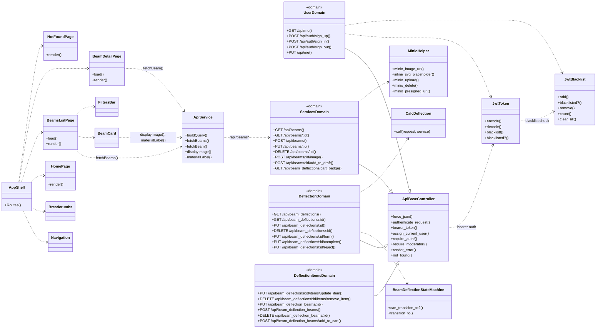

# Диаграмма классов (опирается на исходную схему, без моделей и БД)

Бэкенд сгруппирован по доменам, как в вашей схеме. Модели и БД исключены; показаны контроллеры/сервисы и публичные методы. Фронтенд разделён на все страницы, у страниц показана зависимость от API.

